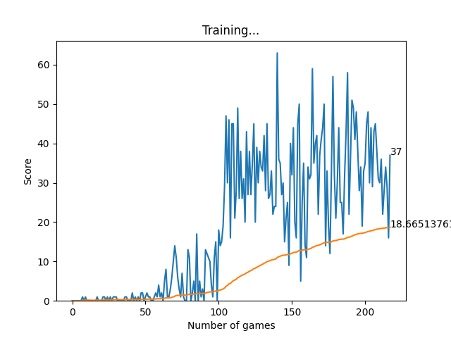

# Snake Game Reinforcement Learning Agent

This project implements a reinforcement learning agent using a snake game environment and a neural network model built with PyTorch.

## Instructions

To run the reinforcement learning agent for the Snake Game:

1. Install dependencies by `pip install -r requirements.txt`.
3. Run `python agent.py` to start training the RL agent.

## Number of Games vs Length of Snake Chart after 200+ Games.

## Files

### 1. `snake_game.py`

Contains the implementation of the Snake Game environment. Key functionalities include:

- Initializing the game environment
- Managing game state, such as the snake's position and food placement
- Handling user input and game logic for movement, collisions, and scoring

### 2. `agent.py`

Implements the RL agent that interacts with the Snake Game environment. Key functionalities include:

- Defining the RL agent class with methods for:
  - Getting the game state
  - Training the agent's model using memory replay and Q-learning
  - Making decisions based on an epsilon-greedy policy

### 3. `model.py`

Defines the neural network model used by the RL agent. It includes:

- The `Linear_QNet` class, a neural network model using linear layers
- The `QTrainer` class for training the Q-network using Q-learning with Adam optimizer and MSE loss

The updated `model.py` file introduces changes to the neural network architecture, switching to a simpler architecture using linear layers.

## Dependencies

- Python 3.11
- Pygame
- PyTorch

## Usage

The `agent.py` script trains the RL agent to play the Snake Game using the defined neural network model.

Feel free to modify hyperparameters, adjust the neural network architecture, or experiment with different RL algorithms to improve the agent's performance 🙃.
